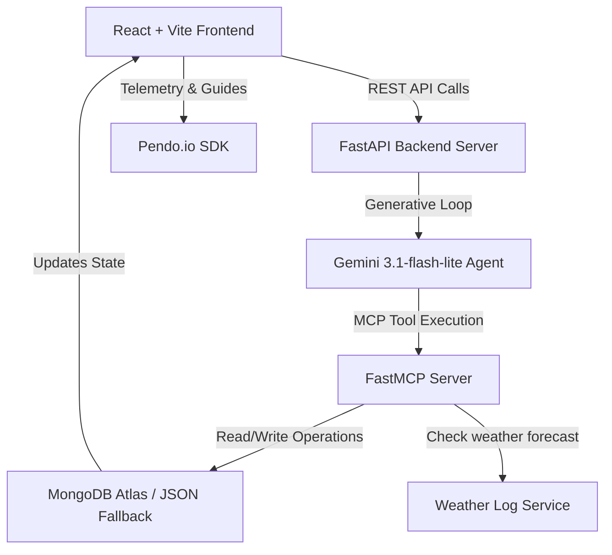

# 🏝️ IslandFlow: Pendo-Integrated Guest Experience & Logistics Engine

### Mind the Product Presents World Product Day: Everyone Ships Now

Welcome to **IslandFlow**! This project is an autonomous AI concierge, B2B SaaS logistics dispatcher, and guest experience optimizer designed for boutique island resorts, eco-lodges, and water transport operators.

By integrating **Google Gemini 3.1-flash-lite**, **Model Context Protocol (MCP)**, **MongoDB Atlas**, and the **Pendo.io SDK**, IslandFlow goes "beyond chat" to actively manage guest itineraries, track user engagement telemetry, monitor weather forecasts, automatically propose activity rescheduling, handle marine dispatches, and log product analytics events directly to the cloud.

Live deployment: [https://islandflow-pendo-162640897083.us-central1.run.app/](https://islandflow-pendo-162640897083.us-central1.run.app/)

---

## 📸 Key Features

*   **Pendo.io SDK B2B Analytics:**
    *   **Visitor & Account Mapping:** Maps individual guests to Pendo `Visitor` IDs and resort properties to B2B `Account` IDs (e.g. `hotel_nayara`).
    *   **Telemetry KPI Dashboard:** Displays real-time feature adoption logs, active initialization states, and custom event tracking (such as `Confirm Swap` and `View Itinerary`).
    *   **Guides & Feedback Triggers:** Integrates guide triggers like the "Product Feedback Clicked" custom guide (`feedback-guide-id-placeholder`) directly into the UI.
*   **Dual-Language Support (ES / EN):**
    *   **Spanish by Default:** The Captain Portal and Guest Concierge default to Spanish (`'es'`) for local marine workers.
    *   **Interactive Lang Toggle Slider:** A premium, sliding toggle control allows smooth transitioning between English and Spanish, persisting preferences via browser storage (`islandflow_lang_v2`).
*   **Guest Deletion Engine:**
    *   Allows operators to manually delete custom-onboarded guests and their bookings via a dedicated `DELETE /api/guest/{guest_id}` endpoint.
    *   **Safety Guards:** Protects default system mock profiles (`g1` to `g10`) from accidental deletions during database resets.
*   **Real-time Weather Dispatcher:** Simulates tropical weather forecasts. If heavy rain affects outdoor activity bookings, the Gemini agent automatically generates alternative schedules and prompts an interactive proposal card in the chat.
*   **Human-in-the-Loop Rescheduling:** Guests retain final approval. Swapping activities requires explicit user consent, instantly updating MongoDB and recalculating travel invoices dynamically.
*   **Live MCP Reasoning Log Console:** A sliding console displaying real-time developer logs of the agent's MCP tool calls (e.g., `get_bookings`, `check_weather`, `reschedule_booking`, `generate_itinerary`).
*   **Dual Database Adaptability:** Detects MongoDB Atlas connection status dynamically. If connection is blocked by SSL/IP whitelists, the app seamlessly falls back to a high-fidelity local `mock_db.json` database.

---

## 🏗️ Architecture



*   **`backend/db.py`**: Manages connection pooling for MongoDB Atlas or handles fallback local operations using a simulated `MockCollection` setup.
*   **`backend/mcp_server.py`**: Exposes FastMCP tools to search tours, inspect logistics status, check weather alerts, and reschedule itinerary slots.
*   **`backend/agent.py`**: Executes the Gemini generative loop. Implements robust exception handlings and lazy-loads the GenAI client.
*   **`frontend/src/App.jsx`**: Main application rendering the guest timeline, operator portal, B2B SaaS dashboard, and Pendo event loggers.

---

## 🚀 Setup & Execution

### 1. Prerequisites
*   **Python 3.12** or higher
*   **Node.js** (v18+) and **npm**
*   **Gemini API Key** (Get one at [Google AI Studio](https://aistudio.google.com/))

### 2. Backend Setup
1.  Navigate to the backend directory:
    ```bash
    cd backend
    ```
2.  Copy `.env.example` to `.env`:
    ```bash
    cp .env.example .env
    ```
3.  Configure your credentials in `.env`:
    *   `GEMINI_API_KEY`: Paste your Gemini API key.
    *   `MONGO_URI` (Optional): To run with a live database, paste your MongoDB Atlas Connection String. If left blank, it cascades to the file-backed JSON fallback.
4.  Activate the virtual environment:
    ```bash
    source venv/bin/activate
    ```
5.  Start the FastAPI backend:
    ```bash
    python main.py
    ```
    The backend server starts on `http://localhost:8000`.

### 3. Frontend Setup
1.  Navigate to the frontend directory:
    ```bash
    cd ../frontend
    ```
2.  Install dependencies:
    ```bash
    npm install
    ```
3.  Run the development server:
    ```bash
    npm run dev
    ```
    Open your browser to `http://localhost:5173`.

---

## 🕹️ Interactive Simulation Walkthrough

1.  **Select Language & Guest:** Navigate to the page. You will see the language is Spanish by default. Toggle the slider to **EN** (English) to read the UI.
2.  **Add a Guest:** Under the **⚙️ Operator Control Panel** (bottom right), input a custom guest name, select a room, and click **Onboard Custom Guest**.
3.  **Simulate Weather Shift:**
    *   Select the current day's date from the dropdown.
    *   Change weather to **Heavy Rain** and status to **Rain Warning**.
    *   Click **Trigger Weather Shift**.
4.  **Confirm AI Schedule Replan:**
    *   The database updates immediately.
    *   The Gemini agent analyzes the timeline, discovers an outdoor activity conflict, and offers an **interactive proposal card** in the chat box to swap it for an indoor alternative.
    *   Click **Confirm Swap** on the card.
    *   Observe the timeline update automatically and notice the **Pendo Active Telemetry console** logging `pendo.track("Confirm Swap")`.
5.  **Delete Custom Guest:** In the Operator panel, locate your custom-added guest and click the delete button (`🗑️`). The guest and their corresponding bookings are deleted via the API, while the system mock profiles (`g1`-`g10`) remain protected.
